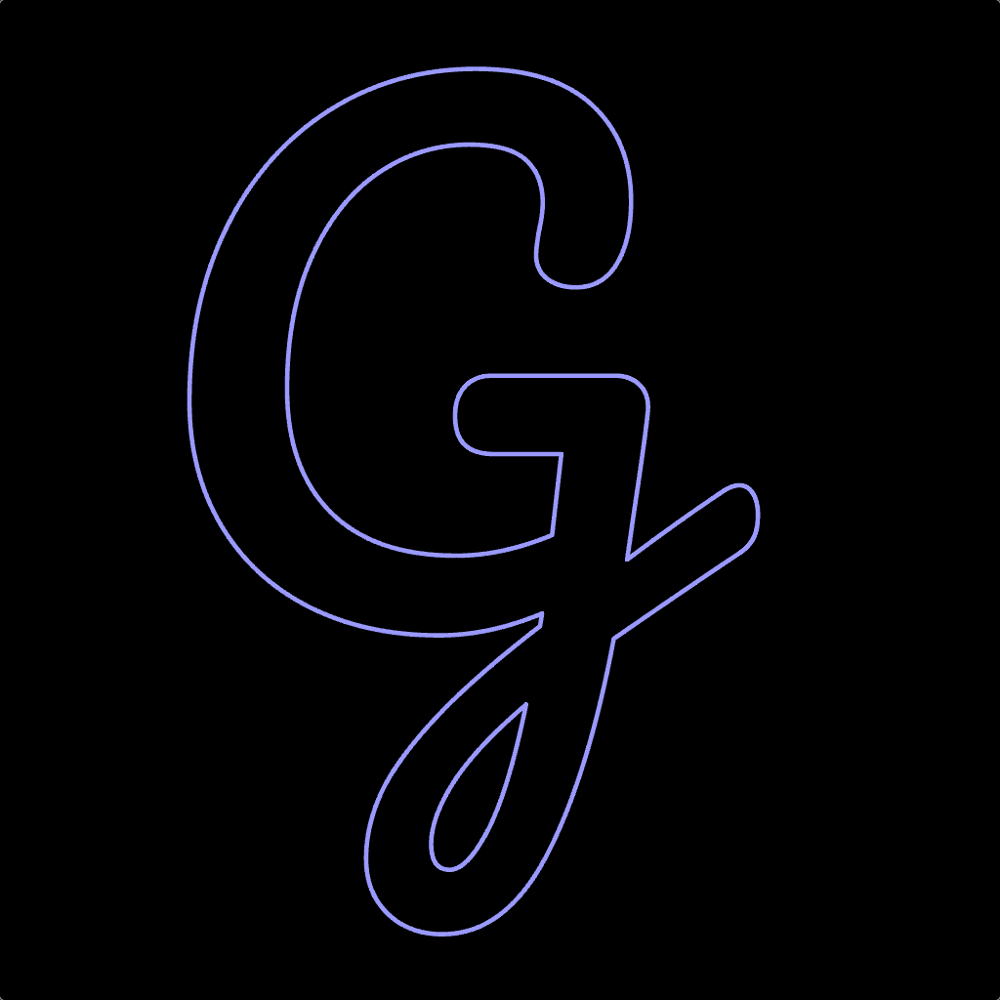

# fonty

A TTF glyph parser and GPU-accelerated character renderer.

> [!WARNING]
> Fonty is not intended for production use. It is merely a experiment delving into font files and complex shader pipelines.

## fonty-gfx

`fonty-gfx` contains a vector glyph renderer built with OpenGL 4.0+. It makes use of the GPU's tesselation engine to build Bézier curves and contains a geometry shader to round out sharp corners between lines.

|  |  |  |
|:----------------:|:----------------:|:----------------:|
